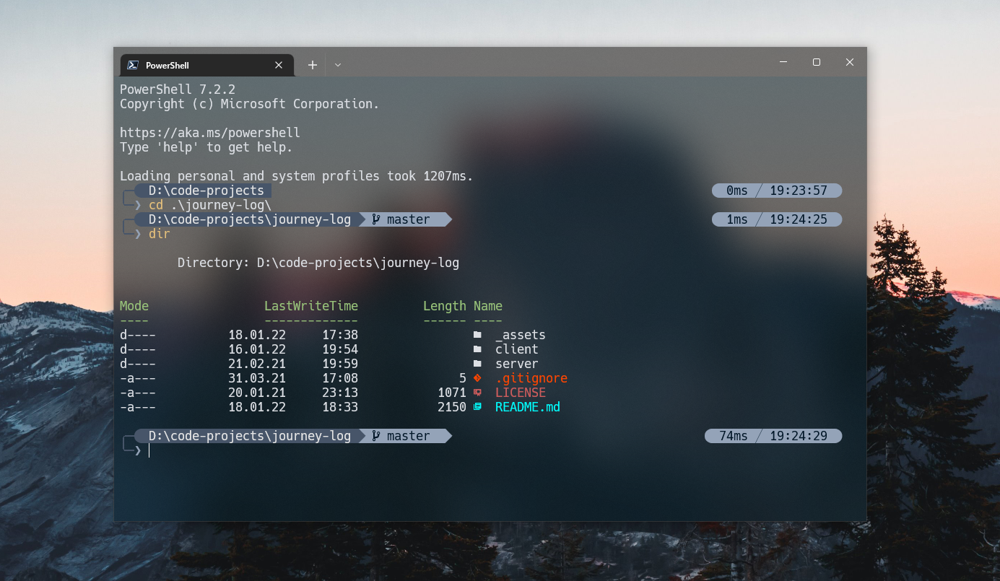

# Dmytro's dotfiles

## Contents

- PowerShell setup (for Windows)
- Neovim setup
- How to use PowerShell setup
- How to use Neovim setup

## PowerShell setup (for Windows)

- [Scoop](https://scoop.sh/) - a command-line installer for Windows
- [PowerShell](https://github.com/PowerShell/PowerShell) - a command-line shell (and an associated scripting language)
- [Oh My Posh](https://ohmyposh.dev/) - prompt theme engine
- [Terminal Icons](https://github.com/devblackops/Terminal-Icons) - folder and file icons
- [Nerd fonts](https://www.nerdfonts.com/#home) - powerline-patched fonts. I'm using `Hack NF`
- [z](https://github.com/badmotorfinger/z) - directory jumper (lets you quickly navigate the file system based on your `cd` command history)

## Neovim setup

Requires Neovim (>= 0.7)

- [vim-plug](https://github.com/junegunn/vim-plug) - A minimalist Vim plugin manager
- [coc.nvim](https://github.com/neoclide/coc.nvim) - Load extensions like VSCode and host language servers
- [nvim-treesitter](https://github.com/nvim-treesitter/nvim-treesitter) - Treesitter configurations and abstraction layer for Neovim (provide some basic functionality such as highlighting)
- [lualine.nvim](https://github.com/nvim-lualine/lualine.nvim) - statusline written in Lua
- [NeoSolarized](https://github.com/overcache/NeoSolarized) - colorscheme for better truecolor support

## How to use PowerShell setup

1. Install [PowerShell](https://github.com/powershell/powershell)
   - Change the default shell to PowerShell
   - Install all windows compatible `.ttf` files of `Hack NF` (Hack) from patched [Nerd fonts](https://github.com/ryanoasis/nerd-fonts/releases)
2. Configure Windows Terminal

   - Settings -> Appearance -> Show acrylic in tab row (requires relaunch)
   - Change the terminal background color in `settings.json`

   - <details>
        <summary>Custom One Half Dark colors</summary>

     ```json
     {
         ...
         "schemes":
         [
         ...
             {
                 "background": "#001B26", // change this
                 "black": "#282C34",
                 "blue": "#61AFEF",
                 "brightBlack": "#5A6374",
                 "brightBlue": "#61AFEF",
                 "brightCyan": "#56B6C2",
                 "brightGreen": "#98C379",
                 "brightPurple": "#C678DD",
                 "brightRed": "#E06C75",
                 "brightWhite": "#DCDFE4",
                 "brightYellow": "#E5C07B",
                 "cursorColor": "#FFFFFF",
                 "cyan": "#56B6C2",
                 "foreground": "#DCDFE4",
                 "green": "#98C379",
                 "name": "One Half Dark (modded)", // rename this
                 "purple": "#C678DD",
                 "red": "#E06C75",
                 "selectionBackground": "#FFFFFF",
                 "white": "#DCDFE4",
                 "yellow": "#E5C07B"
             },
         ...
         ],
         "useAcrylicInTabRow": true
     }
     ```

     </details>

   - Settings -> Defaults -> Appearance -> Color scheme = One Half Dark (modded)
   - Settings -> Defaults -> Appearance -> Font face = Hack NF
   - Settings -> Defaults -> Appearance -> Background opacity = 50%

3. Install [Oh My Posh](https://ohmyposh.dev/)

   - Use custom theme using `powershell/rykhlyk.omp.json` configuration file

4. Install [Terminal Icons](https://github.com/devblackops/Terminal-Icons) and [z](https://github.com/badmotorfinger/z)
5. Update the profile using `powershell/Microsoft.PowerShell_profile.ps1` (PowerShell settings path - `$HOME\Documents\PowerShell`)

## How to use Neovim setup

1. Install [Neovim nightly](https://github.com/neovim/neovim/wiki/Installing-Neovim).
2. Install [vim-plug](https://github.com/junegunn/vim-plug) to install plugins using `:PlugInstall`.
3. Setup [coc.nvim](https://github.com/neoclide/coc.nvim)
   - Install next extensions:
     ```shell
     :CocInstall coc-json coc-tsserver coc-prettier
     ```
   - Configure plugin in `coc-settings.json`
4. Setup [nvim-treesitter](https://github.com/nvim-treesitter/nvim-treesitter)
   - [Windows Support](https://github.com/nvim-treesitter/nvim-treesitter/wiki/Windows-support) - a C compiler is required to compile the parsers needed for nvim-treesitter.
   - Install [GCC](https://gcc.gnu.org) compiler. (NOTE: had issues with `Zig` and `LLVM (Clang)`, so end up using `GCC`)
   - Install required parsers via `:TSInstall c`, `:TSInstall cpp`.
   - Install other parsers `:TSInstall` or `:TSUpdate`.
5. Install [lualine.nvim](https://github.com/nvim-lualine/lualine.nvim) and [NeoSolarized](https://github.com/overcache/NeoSolarized).
6. Add configurations to the `init.vim` file.

---

**Inspired by [Takuya Matsuyama's dotfiles](https://github.com/craftzdog/dotfiles-public). ✨**

Other examples - [albingroen's dotfiles](https://github.com/albingroen/quick.nvim), [NeuralNine's dotfiles](https://github.com/NeuralNine/config-files).
